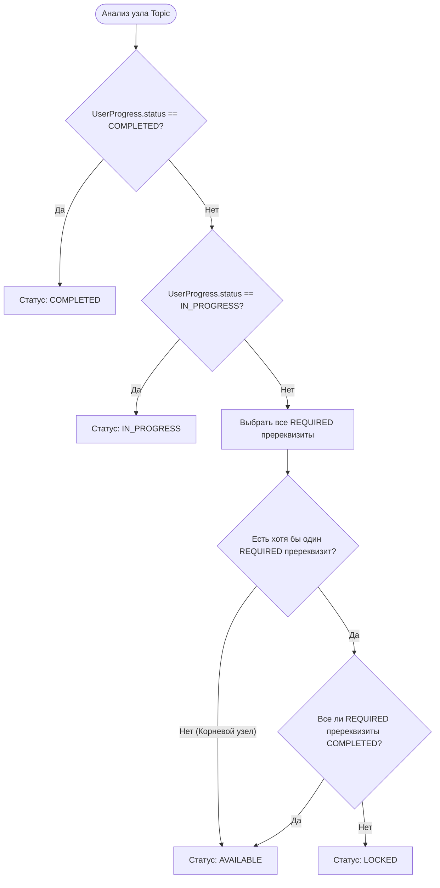
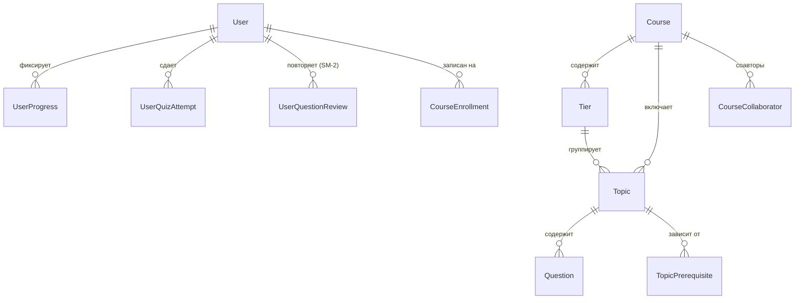

# NOTIS — Системный паспорт и инженерное руководство для ИИ-агентов (AI Agent Engineering Passport)

> **Статус документа**: Обязательный системный инвариант (Single Source of Truth)  
> **Философия документа**: «Не верь комментариям или типам — верь тому, как реально ведет себя рантайм»  
> **Целевая аудитория**: Автономные AI-агенты, инженеры-разработчики, архитекторы  
> **Дата фиксации**: Сентябрь 2026  
> **Версия платформы**: 1.1.0  
> **Базовое состояние тестов**: **290 тестов пройдено (80 сьютов, 100% green), сборка Turbopack валидна**

---

## 0. Назначение документа и операционные директивы для ИИ-агентов

Данный документ представляет собой исчерпывающий системный паспорт проекта **Notis**. Он предназначен для того, чтобы любой новый ИИ-агент (Claude, Gemini, Cursor Agent, Windsurf и др.) мог мгновенно получить 100% честного контекста о кодовой базе, архитектурных инвариантах, доменных движках, базе данных, скрытом техническом долге и правилах безопасной модификации кода **без доступа к истории предыдущих чатов**.

### 0.1. Главный операционный инвариант
Перед завершением любой задачи, передачей результата пользователю или созданием коммита агент **ОБЯЗАН** запустить полный пайплайн проверки качества:
```bash
pnpm validate
```
Данная команда выполняет:
1. `pnpm typecheck` (`tsc --noEmit`) — строгая проверка типов TypeScript 5.8+.
2. `pnpm test` (`tsx --test 'src/**/*.test.ts'`) — запуск всех 290 нативных тестов Node.js.
3. `pnpm build` (`next build`) — продакшн-компиляция проекта в Next.js 16 через Turbopack с проверкой границ RSC / Client и генерации маршрутов.

> [!CAUTION]
> **ПОЛИТИКА НУЛЕВОЙ РЕГРЕССИИ (ZERO-REGRESSION POLICY)**:  
> В репозитории зафиксировано **290 активных тестов**. Ни один тест не должен быть сломан, удален или закомментирован. Любая новая функциональность или Server Action обязаны сопровождаться модульными тестами, покрывающими как валидные, так и невалидные/граничные сценарии.

---

## 1. Архитектура и технологический стек

### 1.1. Таблица используемых библиотек и версий

| Пакет / Библиотека | Точная версия | Назначение и контекст применения |
| :--- | :--- | :--- |
| **`next`** | `16.3.4` | Ядро платформы: App Router, Turbopack, React Server Components (RSC), Server Actions. |
| **`react`**, **`react-dom`** | `19.2.8` | React 19: поддержка `useTransition`, `useActionState`, серверных примитивов и Action hooks. |
| **`prisma`**, **`@prisma/client`** | `6.19.3` | ORM для строго типизированных запросов к PostgreSQL, миграций и транзакций `$transaction`. |
| **`@auth/prisma-adapter`** | `2.11.3` | Адаптер Prisma для интеграции с базой данных сессий и пользователей Auth.js. |
| **`next-auth`** | `5.0.0-beta.32` | Аутентификация: JWT-сессии, Credentials (email/password), OAuth (GitHub, Google), RBAC. |
| **`@xyflow/react`** | `12.11.6` | Аппаратно-ускоренный интерактивный бесконечный холст графа (React Flow): зум, миникарта, кастомные узлы и ребра. |
| **`tailwindcss`**, **`@tailwindcss/postcss`** | `^4.0.0` | Tailwind CSS v4: CSS-first конфигурация через `@theme`, отсутствие `tailwind.config.js`, строгие дизайн-токены. |
| **`zod`** | `^4.5.4` / `3.x compat` | Валидация входных данных Server Actions на границе клиент-сервер, схемы вопросов квиза, вывод типов `z.infer`. |
| **`zustand`** | `^5.0.15` | Клиентское реактивное состояние интерактивного роадмапа (`use-roadmap-store.ts`). |
| **`bcryptjs`**, **`@types/bcryptjs`** | `^3.0.3` | Хеширование паролей пользователей (соль 10-12 раундов) при регистрации и смене пароля. |
| **`react-markdown`** | `^10.1.0` | Безопасный рендеринг контента тем, выжимок и пояснений к вопросам. |
| **`remark-gfm`** | `^4.0.1` | Плагин GitHub Flavored Markdown: таблицы, чекбоксы, зачеркивания. |
| **`remark-math`** | `^6.0.0` | Парсинг математических выражений LaTeX в Markdown (`$inline$` и `$$display$$`). |
| **`rehype-katex`** | `^7.0.1` | Рендеринг формул KaTeX в семантический HTML/MathML. |
| **`rehype-highlight`** | `^7.0.2` | Подсветка синтаксиса кодовых блоков в ридере тем. |
| **`katex`**, **`@types/katex`** | `^0.18.5` | Математический типографический движок для формул без гидратационных расхождений. |
| **`mermaid`** | `^11.17.2` | Динамический рендеринг архитектурных и алгоритмических диаграмм в ридере. |
| **`lucide-react`** | `^1.39.0` | Векторные иконки интерфейса. |
| **`clsx`**, **`tailwind-merge`** | `^2.1.1`, `^3.6.0` | Утилита `cn(...)` для слияния классов Tailwind CSS без коллизий. |
| **`@t3-oss/env-nextjs`** | `^0.13.11` | Типобезопасная валидация переменных окружения при старте приложения (`src/shared/config/env.ts`). |
| **`tsx`** | `^4.23.13` | Рантайм для быстрого запуска сид-скрипта (`prisma/seed.ts`) и нативных тестов Node.js (`node:test`). |
| **`typescript`** | `^5.0.0` | Статический анализ типов со строгими настройками компилятора (`strict: true`). |

---

### 1.2. Принципы изоляции Next.js 16 (App Router + Turbopack)

1. **RSC как дефолтный слой выборки данных**:
   - Все файлы маршрутов `page.tsx` (каталог `/courses`, роадмап `/courses/[slug]`, ридер `/courses/[slug]/topics/[topicSlug]`, профиль `/profile`, панель админа `/admin/users`) являются **серверными компонентами** (Server Components).
   - Загрузка данных происходит напрямую через сервисы базы данных (`src/modules/*/services/*-service.ts`) без лишних API-прослоек и без задержек сетевого водопада (Network Waterfall).
2. **Изоляция Client Components (`"use client"`)**:
   - Директива `"use client"` выставляется только на интерактивных границах:
     * Холст роадмапа (`RoadmapCanvas.tsx`) и холст Студии (`StudioCanvas.tsx`).
     * Контейнер квиза и модальное окно (`QuizContainer.tsx`, `QuizModal.tsx`).
     * Панель тренажера карточек SM-2 (`PracticeDeck.tsx`).
     * Редактор контента темы в Студии (`StudioTopicDrawer.tsx`).
     * Настройки профиля (`ProfileSettingsView.tsx`).
   - Клиентские компоненты получают сериализованные DTO (Data Transfer Objects) от серверных компонентов и вызывают мутации исключительно через Safe Server Actions.
3. **Строгие правила директивы `"use server"`**:
   - В Next.js 16 файлы с директивой `"use server"` могут экспортировать **исключительно асинхронные функции**.
   - Попытка экспортировать константу, интерфейс или объект Zod-схемы из `"use server"` файла приводит к ошибке сборки Turbopack: `Cannot export non-async function from a "use server" file`.
   - В Notis действует жесткое разделение: Zod-схемы выносятся в парные файлы `*.schemas.ts`.

---

### 1.3. Пайплайн Server Actions (Safe Action Pipeline & Result Pattern)

Все мутации данных в Notis стандартизированы через фабрику `createSafeAction` (`src/server/actions/safe-action.ts`):

```typescript
export type ActionErrorCode =
  | "UNAUTHORIZED"
  | "FORBIDDEN"
  | "NOT_FOUND"
  | "BAD_REQUEST"
  | "CONFLICT"
  | "INTERNAL_SERVER_ERROR";

export type ActionResult<T> =
  | { success: true; data: T }
  | { success: false; error: ActionError };
```

#### Фазы выполнения Safe Action:
1. **Zod Input Validation**: сырые аргументы от клиента `rawInput` валидируются через `schema.safeParseAsync(rawInput)`. В случае несоответствия экшен немедленно возвращает `{ success: false, error: { code: "BAD_REQUEST", fieldErrors } }`. Бизнес-логика даже не начинает выполняться.
2. **Session Context Injection**: сессия извлекается из `getAuthSession()` и пробрасывается в обработчик как `{ session }`.
3. **Domain Error Guard**: доменные и бизнес-ошибки выбрасываются с помощью `throw new ActionException(code, message)` и мапятся в структурированный `ActionResult`.
4. **Next.js Framework Exception Passthrough**: исключения фреймворка `NEXT_REDIRECT` и `NEXT_NOT_FOUND` проверяются по полю `error.digest` и пробрасываются дальше (`throw error`), чтобы штатные редиректы Next.js продолжали работать.
5. **Masking Unexpected Crashes**: любые непредвиденные сбои (падение подключения к базе, системные ошибки) логируются на сервере в `console.error`, а клиенту возвращается обезличенный ответ с кодом `INTERNAL_SERVER_ERROR`.
6. **Cache Revalidation**: после успешной мутации вызывается `revalidatePath(...)` для актуализации кэша RSC.

---

### 1.4. Prisma 6 и Neon PostgreSQL

- **Синглтон клиента** (`src/server/db/client.ts`): предотвращает исчерпание пула соединений Neon Serverless при горячей перезагрузке (HMR) в процессе разработки за счет сохранения инстанса в `globalThis.prismaGlobal`.
- **Реляционная целостность и `onDelete: Restrict`**:
  Критические связи между пользователями, курсами, темами, вопросами и попытками сдачи имеют модификатор `onDelete: Restrict` (либо не имеют автоматического каскада на уровне БД).
  > [!IMPORTANT]
  > **Никаких прямых `prisma.course.delete()` или `prisma.topic.delete()`!**  
  > Прямое удаление вызовет ошибку PostgreSQL `P2003 (Foreign key constraint violation)`. Все сложные удаления оформляются как атомарный сценарий в `prisma.$transaction`.

---

### 1.5. React Flow (@xyflow/react)

- **Интерактивный граф**: холст визуализирует образовательный роадмап как ориентированный ациклический граф (DAG).
- **Кастомные элементы**:
  - `TopicNode` (`src/modules/roadmap/components/nodes/topic-node.tsx`): узел темы с иконками статусов тумана войны, бейджем тира, индикатором сложности и меткой обновления контента.
  - `TopicEdge` (`src/modules/roadmap/components/edges/topic-edge.tsx`): ребро связи между темами. Поддерживает типы `required` (сплошная стрелка) и `recommended` (пунктирная стрелка), а также визуальное состояние разблокировки `isUnlocked`.
- **Дебаунс синхронизации координат (500 мс)**: перемещение узлов в Авторской Студии аккумулирует координаты в локальном состоянии и сбрасывает их на сервер пачкой через `updateNodePositionsAction`, исключая паразитные запросы к базе данных.

---

### 1.6. Auth.js (NextAuth v5) и ролевая модель (RBAC)

- **Конфигурация** (`src/server/auth/config.ts`):
  - Стратегия сессий: `jwt`.
  - Провайдер `Credentials`: проверка email и пароля через `bcrypt.compare`.
  - Поддержка OAuth: GitHub и Google (активируются при наличии client id/secret в окружении).
  - Проверка блокировки пользователя: если в БД `user.isBanned === true` или `user.deletedAt !== null`, вход немедленно блокируется.
  - Callbacks `jwt` и `session`: токен и объект сессии обогащаются каноническим `id` и ролью (`USER`, `AUTHOR`, `ADMIN`). При каждом обращении роль и статус бана динамически сверяются с базой данных.
- **Роли пользователей**:
  - `USER` (Студент): изучение открытых курсов, прохождение квизов, тренировка SM-2, накопление XP.
  - `AUTHOR` (Автор): создание собственных курсов, управление графом в Студии (`/studio/[slug]`), добавление тем и вопросов.
  - `ADMIN` (Супер-администратор): доступ к панели `/admin/users`, смена ролей пользователей, модерация и удаление любых курсов платформы.
- **Guard проверки авторства** (`assertCourseAuthor`, `src/server/auth/rbac.ts`):
  Проверяет, является ли пользователь супер-администратором (`role === "ADMIN"`) либо имеет запись в таблице `CourseCollaborator` с ролью `OWNER` или `EDITOR` для запрашиваемого курса. При нехватке прав выбрасывает `ActionException("FORBIDDEN", ...)`.

---

## 2. Незыблемые правила, архитектурные инварианты и запреты

### 2.1. Изоляция Zod-схем и типов от `"use server"`

#### Причина инварианта:
В Next.js 16 (App Router + Turbopack) директива `"use server"` обозначает граничный файл серверных экшенов (RPC-эндпоинтов). Компилятор Next.js анализирует все экспорты такого файла и требует, чтобы каждый экспорт был асинхронной функцией. Если экспортировать из такого файла Zod-схему (например, `export const schema = z.object(...)`), компилятор упадет с фатальной ошибкой сборки.

#### Стандарт Notis:
Все серверные действия разделены строго на **пары файлов**:
1. `src/server/actions/[name]-actions.schemas.ts`:
   - Содержит Zod-схемы валидации (`createCourseSchema`, `submitQuizSchema` и т.д.).
   - Экспортирует выведенные типы входов и выходов (`z.infer<typeof ...>`).
   - **Не содержит** директивы `"use server"`. Может свободно импортироваться как серверным кодом, так и клиентскими формами (`"use client"`).
2. `src/server/actions/[name]-actions.ts`:
   - Начинается строго с директивы `"use server"`.
   - Импортирует схемы из своего `.schemas.ts`.
   - Экспортирует **только** функции экшенов, обернутые в `createSafeAction`.

---

### 2.2. Модель Zero-Trust в Quiz Engine

1. **Никакой утечки ответов клиенту**:
   - Клиентский DTO вопроса (`QuizQuestionDTO`) содержит только формулировку, варианты ответов (`options`), а для задач по программированию — открытые тест-кейсы.
   - Поля `correctAnswerIndexes`, `acceptedAnswers`, regex-шаблоны и скрытые тест-кейсы **никогда не отправляются браузеру**.
2. **Изоляция объяснений (`explanation`)**:
   - Поле с подробным разбором темы и ошибок отправляется клиенту **только в составе результатов завершенной попытки** (`QuizResultDTO.breakdown`).
3. **Защита от подбора правильных ответов при несдаче**:
   - Если студент набрал меньше проходного балла ($< 80\%$), сервер **принудительно затирает** правильные ответы:
     ```typescript
     // quiz-actions.ts:203-210
     if (!quizResult.passed) {
       return {
         ...quizResult,
         breakdown: quizResult.breakdown.map((item) => ({
           ...item,
           correctOptionIds: [],
           explanation: null,
         })),
       };
     }
     ```
     Студент видит, в каких вопросах он ошибся, но не получает подсказок до тех пор, пока честно не сдаст тест.
4. **XP Anti-Exploit (Защита от накрутки опыта)**:
   - Базовый опыт за тему (+50 XP) начисляется **строго один раз** при первом завершении темы (`isFirstCompletion = true`).
   - Пересдача теста (`retakeQuizAction`) или повторный сабмит возвращают `xpEarned = 0`. Опыт начисляется исключительно серверной транзакцией, подделать его с клиента невозможно.

---

### 2.3. Каскадные удаления (P2003) и транзакции

Поскольку все ключевые внешние ключи настроены с политикой `onDelete: Restrict`, попытка прямого удаления родительской сущности вызывает ошибку:
```
PrismaClientKnownRequestError: P2003: Foreign key constraint failed on the field: ...
```

Все удаления в проекте выполняются внутри контролируемой транзакции `prisma.$transaction(async (tx) => ...)` в строго обратном топологическом порядке зависимостей:

#### А. Сценарий удаления темы (`deleteTopicAction`):
1. Выборка всех ID вопросов темы `Question.findMany({ where: { topicId } })`.
2. `tx.userQuizAttempt.deleteMany({ where: { questionId: { in: questionIds } } })`
3. `tx.userQuestionReview.deleteMany({ where: { questionId: { in: questionIds } } })`
4. `tx.questionTranslation.deleteMany({ where: { questionId: { in: questionIds } } })`
5. `tx.question.deleteMany({ where: { id: { in: questionIds } } })`
6. `tx.topicPrerequisite.deleteMany({ where: { OR: [{ topicId }, { prerequisiteId: topicId }] } })`
7. `tx.defaultGraphLayout.deleteMany({ where: { topicId } })`
8. `tx.userGraphLayout.deleteMany({ where: { topicId } })`
9. `tx.userProgress.deleteMany({ where: { topicId } })`
10. `tx.topicTag.deleteMany({ where: { topicId } })`
11. `tx.topicTranslation.deleteMany({ where: { topicId } })`
12. `tx.topic.delete({ where: { id: topicId } })`

#### Б. Сценарий удаления курса (`deleteCourseAction`):
1. Проверка прав: вызывающий пользователь должен быть `OWNER` курса или супер-администратором (`ADMIN`).
2. Каскадное удаление всех тем курса и их вопросов (по алгоритму А).
3. `tx.tierTranslation.deleteMany` $\to$ `tx.tier.deleteMany`.
4. `tx.payment.deleteMany` (связанных с курсом или зачислением).
5. `tx.courseEnrollment.deleteMany`.
6. `tx.courseCollaborator.deleteMany`.
7. `tx.courseTag.deleteMany`.
8. `tx.courseTranslation.deleteMany`.
9. `tx.planCourse.deleteMany`.
10. `tx.course.delete({ where: { id: courseId } })`.

#### В. Сценарий удаления аккаунта (`deleteAccountAction`):
1. **Защита от осиротения курсов**: если пользователь является **единственным владельцем (OWNER)** хотя бы одного курса, удаление аккаунта отклоняется (`ActionException("BAD_REQUEST")`). Автор обязан предварительно удалить свои курсы или передать права соавтору.
2. В транзакции последовательно зачищаются: `userQuizAttempt`, `userQuestionReview`, `userProgress`, `userGraphLayout`, `payment`, `subscription`, `courseEnrollment`, `courseCollaborator`, `session`, `account`, и в финале — `user.delete()`.

---

### 2.4. Запрет на хардкод типов вопросов (Strategy / Registry Pattern)

> [!CAUTION]
> **КАТЕГОРИЧЕСКИЙ ЗАПРЕТ**:  
> Запрещается реализовывать логику типов вопросов через разрозненные ветки `switch(type)` или `if(type === ...)` в новых компонентах UI и стратегиях.

Все типы вопросов обязаны реализовывать полиморфный контракт `QuestionStrategy` (`src/modules/quiz/strategies/strategy-types.ts`):

```typescript
export interface QuestionStrategy<TConfig = unknown, TAnswer = unknown> {
  readonly type: QuizQuestionType;
  readonly configSchema: z.ZodType<TConfig>;
  readonly answerSchema: z.ZodType<TAnswer>;
  validateAnswer(raw: unknown): AnswerValidationResult<TAnswer>;
  evaluate(answer: TAnswer, context: EvaluationContext): boolean;
}
```

Все стратегии регистрируются в едином реестре `QuestionStrategyRegistry` (`src/modules/quiz/strategies/registry.ts`).  
Клиентский рендеринг осуществляется через фабрику `QuestionInputFactory` (`src/modules/quiz/components/question-types/QuestionInputFactory.tsx`), которая выбирает соответствующий компонент по ключу стратегии без `switch/case`.

> [!WARNING]
> ⚠️ **РЕАЛЬНОЕ СОСТОЯНИЕ В КОДЕ (QUIRK):**  
> Несмотря на то, что целевой паттерн — Strategy Registry (`src/modules/quiz/strategies/registry.ts`), в `src/modules/quiz/services/quiz-service.ts` сохраняются прямые вызовы легаси-эвалюаторов и хардкод проверки для типа `CODE` (строки 192–207 и 258–268 при фильтрации скрытых тестов и подготовке DTO). При добавлении новых типов вопросов обновляйте **НЕ ТОЛЬКО** реестр, но и точку входа в `quiz-service.ts`.

---

### 2.5. Направление связей графа и DFS Cycle Guard

- **Семантическое направление ребра**:  
  В модели `TopicPrerequisite`:
  - `source` (`prerequisiteId`) — тема-пререквизит (должна быть пройдена раньше).
  - `target` (`topicId`) — целевая тема (разблокируется только после освоения `source`).
  - Поток знаний направлен строго: $\text{source} \to \text{target}$.
- **DFS Cycle Guard** (`src/modules/roadmap/lib/cycle-detector.ts`):  
  Любая попытка соединения узлов в Авторской Студии или через Server Action обязана проходить проверку `wouldCreateCycle(existingEdges, newEdge)`:
  1. *Самозамыкание*: если `newEdge.source === newEdge.target`, ребро отклоняется немедленно.
  2. *Поиск в глубину (DFS)*: строится граф существующих ориентированных связей. Запускается обход из вершины `newEdge.target`. Если в процессе обхода обнаруживается достижимость вершины `newEdge.source`, значит, в графе уже есть путь $\text{target} \leadsto \text{source}$, и добавление связи $\text{source} \to \text{target}$ замкнет цикл. Операция отклоняется с ошибкой `ActionException("CONFLICT", "Циклическая зависимость")`.

---

## 3. Полная карта кодовой базы

```
notis/
├── app/                              # Presentation Layer (Next.js App Router)
├── docs/                             # Архитектурная документация и PRD
│   ├── ARCHITECTURE_RULES.md         # Системные инварианты (v1.0.0)
│   ├── PRD.md                        # Product Requirements Document (v1.1.0)
│   └── TASK_QUEUE.md                 # Очередь задач и журнал релизов
├── prisma/                           # База данных
│   ├── schema.prisma                 # 25 моделей, 15 перечислений (PostgreSQL)
│   └── seed.ts                       # Идемпотентный сид с демонстрационным DAG-курсом
├── src/
│   ├── modules/                      # Доменные модули (Domain Boundaries)
│   │   ├── code-runner/              # Изолированная песочница запуска кода (Web Worker)
│   │   ├── gamification/             # XP, уровни, стрик 36ч, тепловая карта
│   │   ├── quiz/                     # Strategy/Registry движок квизов (5 типов)
│   │   ├── roadmap/                  # Directed Acyclic Graph, Fog of War, React Flow
│   │   ├── spaced-repetition/        # SuperMemo-2 (SM-2), очереди повторения
│   │   ├── studio/                   # Авторская визуальная Студия конструирования курсов
│   │   └── topic/                    # Ридер контента темы, тезисы, ловушки
│   ├── server/                       # Серверная инфраструктура
│   │   ├── actions/                  # Safe Server Actions (15 пар .ts и .schemas.ts)
│   │   ├── auth/                     # NextAuth v5, сессии, RBAC guards
│   │   ├── db/                       # Синглтон PrismaClient
│   │   └── services/                 # Серверные сервисы (административный бэкофис)
│   └── shared/                       # Общесистемные ресурсы
│       ├── config/                   # Константы (маршруты, параметры), env с Zod
│       ├── lib/                      # Утилиты (cn, slugify)
│       └── ui/                       # Дизайн-система (Button, Card, Drawer, Markdown, Navbar)
```

---

### 3.1. Детализация модулей `src/modules/`

#### 1. `src/modules/code-runner/`
- **Назначение**: Безопасное исполнение JavaScript/TypeScript решений студентов.
- **Файлы**:
  - `lib/worker-runner.ts`: генератор скрипта воркера `buildWorkerScript()`, запуск через Web Worker с Blob URL, функция глубокого сравнения результатов `deepEqual(a, b)`, обнаружение функции решения `findDeclaredFunctionNames()`, серверный/тестовый fallback через `node:vm` (`executeCodeNodeFallback()`).
  - `components/CodeRunner.tsx`: интерактивный редактор кода с подсветкой синтаксиса, кнопкой запуска и панелью прогона тестов.
  - `types.ts`: интерфейсы `TestCase`, `TestResult`, `ExecutionResult`.

#### 2. `src/modules/gamification/`
- **Назначение**: Мотивационный движок, расчет уровней, ударного режима и визуализация активности.
- **Файлы**:
  - `services/level-progression.ts`: чистая квадратичная функция уровней `calculateUserLevel(xp)` и `getLevelBaseXP(level)`.
  - `services/streak-calculator.ts`: расчет стрика с учетом 36-часового льготного периода `calculateStreakStatus(lastStudyAt, currentStreak)`.
  - `services/profile-service.ts`: агрегация данных профиля `getProfileData(userId)` (хитмап за 365 дней, статистика пройденных курсов).
  - `components/`: `StreakCard.tsx` (индикатор ударного режима и предупреждения о сгорании), `ActivityHeatmap.tsx` (матрица активности за год), `ProfileHeader.tsx` (аватар, текущий уровень, прогресс-бар XP), `CourseProgressCard.tsx` (карточка зачисления).

#### 3. `src/modules/quiz/`
- **Назначение**: Полиморфный движок оценки знаний Zero-Trust.
- **Файлы**:
  - `strategies/strategy-types.ts`: базовый интерфейс `QuestionStrategy<TConfig, TAnswer>`.
  - `strategies/registry.ts`: глобальный реестр `registerStrategy()`, `getStrategy(type)`.
  - `strategies/single-choice/`: схема и эвалюатор одиночного выбора (`SingleChoiceStrategy`).
  - `strategies/multiple-choice/`: схема и эвалюатор множественного выбора (`MultipleChoiceStrategy`).
  - `strategies/short-answer/`: нормализация текста (trim, lowercase) и сверка по `acceptedAnswers` (`ShortAnswerStrategy`).
  - `strategies/code/`: валидация решения и запуск публичных/скрытых тестов (`CodeStrategy`).
  - `strategies/flashcard/`: самооценка по шкале SM-2 $q \in [0, 5]$ ($q \ge 3 \implies$ зачет) (`FlashcardStrategy`).
  - `services/quiz-service.ts`: `getQuizForTopic()` (извлечение публичного DTO без утечки ответов), `evaluateQuizSubmission()` и чистая функция `calculateQuizResult()`.
  - `components/`: `QuizContainer.tsx` (контейнер сессии квиза), `QuizStepper.tsx` (пошаговый проход по вопросам), `QuizCard.tsx` (карточка вопроса), `QuizModal.tsx` (модальное окно), `QuizResultView.tsx` (экран результатов и разбора ошибок).
  - `components/question-types/`: `QuestionInputFactory.tsx` (реестр клиентских инпутов), `SingleChoiceInput.tsx`, `MultipleChoiceInput.tsx`, `ShortAnswerInput.tsx`, `CodeInput.tsx`, `FlashcardInput.tsx`.

#### 4. `src/modules/roadmap/`
- **Назначение**: Графовое представление структуры курса, туман войны и навигация.
- **Файлы**:
  - `lib/cycle-detector.ts`: алгоритм обнаружения циклов `wouldCreateCycle(existingEdges, newEdge)` на базе DFS.
  - `services/roadmap-layout.ts`: `computeDeterministicLayout(tiers, topics)` — алгоритм автоматической раскладки узлов по колонкам тиров с вертикальным шагом.
  - `services/roadmap-transform.ts`: чистая функция `transformCourseToGraphDTO()` — движок Fog of War, вычисляющий состояния `LOCKED`, `AVAILABLE`, `IN_PROGRESS`, `COMPLETED` и разблокировку связей `isUnlocked`.
  - `services/roadmap-service.ts`: серверная выборка данных графа курса из Prisma.
  - `services/course-catalog-service.ts`: выборка каталога курсов с фильтрацией по поисковой строке и сложности.
  - `hooks/use-roadmap-store.ts`: клиентский Zustand-стор для управления зумом, панорамированием и активным узлом.
  - `components/`: `RoadmapCanvas.tsx` (холст React Flow студента), `TopicNode.tsx`, `TopicEdge.tsx`, `RoadmapDrawer.tsx` (шторка предпросмотра темы), `CourseOptionsMenu.tsx`.

#### 5. `src/modules/spaced-repetition/`
- **Назначение**: Интервальное повторение по алгоритму SuperMemo-2.
- **Файлы**:
  - `services/sm2-algorithm.ts`: математическая функция `calculateSM2(input, currentDate)`.
  - `services/spaced-card-service.ts`: `enrollTopicIntoReviewQueue(userId, topicId, tx)` — автоматическая постановка вопросов темы в очередь повторения студента при сдаче материала; генерация fallback-карточки из `keyPoints` для тем без формального квиза.
  - `services/spaced-repetition-service.ts`: выборка карточек на сегодня `getDueFlashcards(userId)` (лимит 20 шт).
  - `components/`: `PracticeDeck.tsx` (колода карточек), `FlashcardView.tsx` (интерактивная двусторонняя карточка с кнопками оценки 0–5).

#### 6. `src/modules/studio/`
- **Назначение**: Профессиональная визуальная авторская среда конструирования курсов.
- **Файлы**:
  - `services/studio-service.ts`: выборка полного графа курса для автора `getCourseStudioGraph()` (без наложения тумана войны, с отображением черновиков).
  - `components/studio-canvas.tsx`: холст редактирования графа с drag-and-drop узлов, созданием и удалением связей.
  - `components/studio-topic-drawer.tsx`: шторка настройки темы: заголовок, сложность, summary, ключевые тезисы, ловушки, конструктор вопросов.
  - `components/CourseSettingsModal.tsx`: настройки публикации курса, названия и описания.
  - `components/CourseTiersModal.tsx`: управление этапами (тирами) курса (создание, переименование, цвет бэйджа).
  - `components/StudioFlashcardsTab.tsx`: конструктор авторских двусторонних карточек.

#### 7. `src/modules/topic/`
- **Назначение**: Ридер учебных материалов темы.
- **Файлы**:
  - `services/topic-service.ts`: выборка контента темы `getTopicDetails(courseSlug, topicSlug, options)`.
  - `components/`: `TopicReaderView.tsx` (главный экран ридера), `TopicHeader.tsx` (метаданные, тир, сложность, время чтения), `TopicKeyPoints.tsx` (блок концепций и ловушек), `TopicFooterAction.tsx` (кнопка вызова квиза или прямая отметка «Я освоил материал»).

---

### 3.2. Серверный слой `src/server/`

- **`src/server/actions/`**: 15 пар файлов экшенов и их Zod-схем:
  1. `admin-course-actions[.schemas].ts`: создание курса, обновление настроек публикации, полное каскадное удаление курса.
  2. `admin-flashcard-actions[.schemas].ts`: создание, редактирование и удаление ручных карточек `FLASHCARD`.
  3. `admin-tier-actions[.schemas].ts`: создание, обновление и удаление тиров курса.
  4. `admin-user-actions[.schemas].ts`: изменение роли пользователя в административной консоли.
  5. `auth-actions[.schemas].ts`: регистрация пользователя через форму Credentials.
  6. `course-actions[.schemas].ts`: запись студента на курс (`enrollCourseAction`).
  7. `course-enrollment-actions[.schemas].ts`: отслеживание статуса зачисления.
  8. `progress-actions[.schemas].ts`: сохранение заметок студента по теме (`updateTopicNotesAction`).
  9. `quiz-actions[.schemas].ts`: серверная сдача квиза (`submitQuizAction`) и сброс попыток для пересдачи (`retakeQuizAction`).
  10. `spaced-repetition-actions[.schemas].ts`: отправка оценки повторения карточки SM-2 (`reviewCardAction`).
  11. `studio-actions[.schemas].ts`: соединение пререквизитов с проверкой на циклы (`connectPrerequisiteAction`), удаление связей (`disconnectPrerequisiteAction`), пакетное сохранение координат узлов (`updateNodePositionsAction`).
  12. `studio-topic-actions[.schemas].ts`: обновление контента темы, создание/редактирование вопросов квиза, публикация темы (`publishTopicAction`).
  13. `studio-topic-lifecycle-actions[.schemas].ts`: создание темы (`createTopicAction`) и безопасное каскадное удаление темы (`deleteTopicAction`).
  14. `topic-actions[.schemas].ts`: отметка темы без квиза «Я освоил материал» (`completeTopicAction`).
  15. `user-settings-actions[.schemas].ts`: смена имени (`updateProfileNameAction`), смена пароля (`changePasswordAction`), полное удаление аккаунта (`deleteAccountAction`).
- **`src/server/auth/`**:
  - `config.ts`: опции NextAuth, провайдеры Credentials/OAuth, обработка JWT и Session.
  - `session.ts`: `getAuthSession()`, типы сессии.
  - `rbac.ts`: guard-функция `assertCourseAuthor(courseSlug, userId)`.
- **`src/server/db/`**:
  - `client.ts`: синглтон PrismaClient.
- **`src/server/services/`**:
  - `admin-user-service.ts`: выборка списка пользователей с фильтрацией, пагинацией и агрегацией зачислений/курсов.

---

### 3.3. Маршруты презентационного слоя `app/`

| Маршрут | Тип компонента | Назначение | Требуемый доступ |
| :--- | :---: | :--- | :--- |
| `app/page.tsx` | RSC | Главный лендинг платформы Notis: миссия, возможности, переход к курсам. | Публичный (Guest) |
| `app/login/page.tsx` | RSC + Client | Экран входа: форма Credentials (email/password) и кнопки входа через GitHub/Google. | Публичный (гостевой) |
| `app/register/page.tsx` | RSC + Client | Экран регистрации нового студента платформы. | Публичный (гостевой) |
| `app/courses/page.tsx` | RSC | Каталог курсов с серверной фильтрацией по строке `q` и уровню сложности `difficulty`. | Публичный (Guest/Student) |
| `app/courses/[slug]/page.tsx` | RSC + Client | Интерактивный роадмап курса (хлебные крошки, холст `@xyflow/react`, Fog of War). | Публичный (персональный прогресс) |
| `app/courses/[slug]/topics/[topicSlug]/page.tsx` | RSC + Client | Ридер темы: Markdown, формулы KaTeX, диаграммы Mermaid, запуск квиза. | Guest (если `isFreePreview`), Student |
| `app/practice/page.tsx` | RSC + Client | Тренажер интервального повторения SM-2 с колодой карточек на сегодня. | Авторизованный пользователь |
| `app/profile/page.tsx` | RSC + Client | Личный кабинет: статистика XP, уровень, стрик, хитмап за год, настройки аккаунта. | Авторизованный пользователь |
| `app/studio/[slug]/page.tsx` | RSC + Client | Полноэкранный визуальный конструктор курса: холст графа, шторка темы, модалки настроек. | Автор курса (`OWNER`/`EDITOR`) или `ADMIN` |
| `app/admin/page.tsx` | RSC | Дашборд панели администратора (перенаправление на `/admin/users`). | Только `ADMIN` |
| `app/admin/users/page.tsx` | RSC + Client | Реестр пользователей: фильтр по email/name, выбор роли (`USER`/`AUTHOR`/`ADMIN`), статус бана. | Только `ADMIN` |
| `app/api/auth/[...nextauth]/route.ts` | Route Handler | Эндпоинты авторизации NextAuth (обратные вызовы OAuth, вход, выход). | Системный |
| `app/error.tsx` | Client | Глобальный перехватчик ошибок рендеринга клиентского слоя. | Системный |
| `app/not-found.tsx` | RSC | Экран 404 с кнопкой возврата в каталог курсов. | Системный |

---

## 4. Доменные движки (Domain Engines)

### 4.1. Движок тумана войны (Fog of War Engine)

Движок тумана войны детерминированно рассчитывает доступность узлов графа в функции `transformCourseToGraphDTO` (`src/modules/roadmap/services/roadmap-transform.ts`).

#### Алгоритмические правила расчета статуса темы:
1. Если в `UserProgress` для текущего пользователя зафиксирован статус `COMPLETED` $\implies$ статус узла **`COMPLETED`**.
2. Иначе, если в `UserProgress` статус `IN_PROGRESS` $\implies$ статус узла **`IN_PROGRESS`**.
3. Иначе, выполняется анализ опубликованных строгих пререквизитов темы (`DependencyType.REQUIRED`):
   - Если у темы **нет строгих пререквизитов** (корневой узел графа) $\implies$ статус **`AVAILABLE`**.
   - Если строгие пререквизиты есть: проверяется статус прогресса каждой родительской темы.
     * Если **все** строгие пререквизиты имеют статус `COMPLETED` $\implies$ статус узла **`AVAILABLE`**.
     * Если хотя бы один строгий пререквизит не завершен $\implies$ статус узла **`LOCKED`**.



#### Визуальные и поведенческие характеристики статусов:
- `COMPLETED`: узел подсвечен зеленым цветом статуса (`#10b981`), исходящие из него ребра получают статус `isUnlocked: true`.
- `IN_PROGRESS`: синяя индикация, узел открыт для продолжения чтения или прохождения квиза.
- `AVAILABLE`: бирюзовая подсветка (`#06b6d4`), узел полностью разблокирован для студента.
- `LOCKED`: полупрозрачный узел (`opacity-50`), отображается иконка замка, клик заблокирован (для тем с `isFreePreview: true` гостю доступен предварительный просмотр).

#### Отслеживание версий материала (`hasUpdate`):
Если автор внес изменения в тему и увеличил версию (`Topic.version > UserProgress.completedVersion`), для студента с завершенной темой активируется флаг `progress.hasUpdate = true`. На карточке узла загорается бейдж **«Обновлено»**, стимулирующий повторить актуализированный материал.

---

### 4.2. Алгоритм SuperMemo-2 (SM-2)

Движок интервального повторения реализован в `src/modules/spaced-repetition/services/sm2-algorithm.ts` строго по формулам Петра Возняка.

#### 1. Входные параметры:
- $q \in [0, 5]$ — субъективная оценка воспоминания карточки студентом:
  - 5: Идеальный ответ без колебаний.
  - 4: Правильный ответ после небольшого раздумья.
  - 3: Правильный ответ с заметным усилием.
  - 2: Неверный ответ, правильный легко вспомнился.
  - 1: Неверный ответ, правильный смутно знаком.
  - 0: Полный провал памяти (Blackout).
- $EF$ — текущий фактор легкости (начальный дефолт: 2.5, минимум: 1.3).
- $n$ — счетчик успешных повторений подряд (`repetitionCount`).
- $I$ — текущий интервал в днях (`intervalDays`).

#### 2. Формула пересчета Easiness Factor ($EF'$):
$$EF' = \max\left(1.3, \; EF + \left(0.1 - (5 - q) \cdot (0.08 + (5 - q) \cdot 0.02)\right)\right)$$

#### 3. Формула расчета следующего интервала ($I(n)$):
$$I(n) = \begin{cases} 
1, & \text{если } q < 3 \quad (\text{сброс цикла: } n = 0, \; I = 1) \\
1, & \text{если } q \ge 3 \text{ и } n = 0 \\
6, & \text{если } q \ge 3 \text{ и } n = 1 \\
\text{round}(I(n-1) \cdot EF'), & \text{если } q \ge 3 \text{ и } n \ge 2
\end{cases}$$

#### 4. Источники карточек в очереди повторения (`UserQuestionReview`):
- **Автоматический инжест**: при успешной сдаче квиза (`submitQuizAction`) или отметке темы без квиза (`completeTopicAction`) функция `enrollTopicIntoReviewQueue()` регистрирует вопросы темы в очереди студента с датой `reviewDueAt = now()`. Если у темы нет квиза, автоматически создается карточка из тезисов `keyPoints`.
- **Ручной инжест**: авторские карточки `QuestionType = FLASHCARD`, созданные в Студии, попадают в очередь студентов при освоении темы.

---

### 4.3. Изолированная песочница кода (Web Worker Sandbox) и ее реальные ограничения

Движок выполнения кода (`src/modules/code-runner/lib/worker-runner.ts`) обеспечивает безопасный запуск решений задач по программированию:

1. **Клиентская изоляция через Web Worker**:
   - Пользовательский код компилируется в самодостаточный скрипт `buildWorkerScript()` и загружается в фоновый поток через `URL.createObjectURL(blob)`.
   - Воркер не имеет доступа к объектам `window`, `document`, `localStorage`, `document.cookie` и защищен от XSS.
2. **Перехват консольного вывода**:
   - Объект `console` подменяется песочницей, перехватывающей вызовы `.log()`, `.warn()`, `.error()`, `.info()` в сериализованный массив `logs`.
3. **Автообнаружение функции решения**:
   - Анализатор `findDeclaredFunctionNames()` находит объявленные функции (`solution` или именованные функции) и передает их в исполнитель тестов.
4. **Таймаут исполнения (Timeout Guard)**:
   - Константа `DEFAULT_TIMEOUT_MS = 2000` мс (2 секунды).
   - Если студент написал бесконечный цикл `while(true)`, таймер прерывает выполнение через `worker.terminate()`, возвращая понятное сообщение: `«Превышен лимит времени выполнения (2 сек)»`.
5. **Глубокое сравнение результатов (`deepEqual`)**:
   - Поддерживает рекурсивное сопоставление примитивов, массивов, объектов, `Date` и `RegExp`.

> [!IMPORTANT]
> ⚠️ **РЕАЛЬНЫЕ ОГРАНИЧЕНИЯ РАНТАЙМА ПЕСОЧНИЦЫ:**  
> 1. **Чистый JS / ES2022 без рантайм-транспиляции**: В браузере **нет** компилятора TypeScript на лету (`tsc` или `esbuild` не вшиты в воркер из соображений размера бандла). Код исполняется движком JavaScript напрямую. Написание TypeScript-типов параметров (`str: string`), интерфейсов или дженериков внутри тела исполняемого кода приведет к синтаксической ошибке браузера (`SyntaxError: Unexpected token ':'`). Решения студентов должны использовать синтаксис ES2022.
> 2. **Запрет внешних зависимостей**: Использование `import`, `require`, сетевых запросов (`fetch`, `XMLHttpRequest`, `WebSocket`) строго запрещено и блокируется на уровне изолированного контекста.
> 3. **Нюансы изоляции `node:vm` в тестах и SSR**: В fallback-ветке `executeCodeNodeFallback` используется контекст `node:vm`. Объекты, возвращенные из контекста, не проходят прямую проверку через `instanceof Array` из-за разных цепочек прототипов между контекстами V8. Поэтому проверка типов в раннере строится строго на `Array.isArray()` и чистом глубоком сравнении `deepEqual`.

---

### 4.4. Движок рендеринга KaTeX и схем Mermaid

Компонент `MarkdownRenderer` (`src/shared/ui/markdown/MarkdownRenderer.tsx`) поддерживает сложную научно-техническую верстку:

> [!IMPORTANT]
> ⚠️ **ИНВАРИАНТ КОНТЕНТА ТЕМ:**  
> Поле `TopicTranslation.contentBlocks` в коде **НЕ ИСПОЛЬЗУЕТСЯ** (всегда пустое). Весь образовательный материал хранится монолитно в поле `TopicTranslation.description` в виде Markdown-текста с поддержкой формул KaTeX (`$`, `$$`) и блоков диаграмм Mermaid (````mermaid ... ````).

1. **Математические формулы (KaTeX)**:
   - Поддерживаются inline-формулы: `$E = mc^2$`, `$O(\log n)$`.
   - Поддерживаются выключные display-формулы:
     ```markdown
     $$\sum_{i=1}^n x_i = \frac{n(n+1)}{2}$$
     ```
   - Настройка `throwOnError: false` предотвращает падение React-дерева при синтаксических ошибках в формулах, окрашивая проблемный фрагмент в `#ec4899`.
2. **Архитектурные диаграммы (Mermaid)**:
   - Кодовые блоки с языком `mermaid` перехватываются компонентом `PreBlock` и монтируют компонент `MermaidDiagram` (`MermaidDiagram.tsx`).
   - Библиотека `mermaid` загружается динамически (`import("mermaid")`), не раздувая стартовый бандл страницы.
   - Инициализируется темная тема (`theme: "dark"`), адаптированная под палитру Notis (`#10121a`, `#0ea5e9`).
   - Каждый рендер генерирует уникальный ID контейнера (`safeId-${Date.now()}`), предотвращая коллизии при повторном монтировании, а при ошибках парсинга удаляет временные SVG из DOM.

---

## 5. База данных: Схема, модели, связи и «спящие» сущности

База данных Notis содержит **25 моделей** и **15 перечислений (Enums)** в `prisma/schema.prisma`.

### 5.1. Карта активных моделей данных



1. **Справочник локалей**:
   - `Locale`: код BCP-47 (`ru`, `en`), статус `isActive`. Связан со всеми таблицами переводов.
2. **Пользователи и аутентификация**:
   - `User`: профиль, email, `passwordHash`, глобальная роль `Role (USER, AUTHOR, ADMIN)`, геймификация (`xp`, `streakDays`, `lastStudyAt`), флаги `isBanned`, `deletedAt`.
   - `Account`: провайдеры OAuth/Credentials (NextAuth).
   - `Session`: активные сессии NextAuth.
   - `VerificationToken`: токены подтверждения email / сброса пароля.
3. **Курс и уровни**:
   - `Course`: слаг, локали, режим обучения `LearningMode`, модель монетизации `PricingModel`, флаги публикации `isPublished`, `isArchived`, кэш `publishedTopicsCount`.
   - `CourseTranslation`: локализованные заголовок `title`, слоган `tagline`, описание `description`.
   - `CourseCollaborator`: права соавторов `CourseRole (OWNER, EDITOR, REVIEWER)`.
   - `Tier`: этап курса (`order`, `badgeColor`, `isPublished`).
   - `TierTranslation`: название тира на разных языках.
4. **Темы и граф роадмапа**:
   - `Topic`: узел графа (`slug`, `difficulty`, `estimatedMinutes`, `version`, `isFreePreview`, `isPublished`).
   - `TopicTranslation`: заголовок `title`, выжимка `summary`, описание `description` (основное тело статьи), списки `keyPoints` (String[]), `pitfalls` (String[]), поле `contentBlocks` (зарезервировано, не используется).
   - `TopicPrerequisite`: ориентированные ребра графа (`topicId` $\to$ `prerequisiteId`), тип связи `DependencyType (REQUIRED, RECOMMENDED)`.
5. **Состояние холста (UI Layouts)**:
   - `DefaultGraphLayout`: авторские координаты узлов на холсте Студии (`positionX`, `positionY`).
   - `UserGraphLayout`: персональные пользовательские координаты узлов.
6. **Квизы и интервальное повторение**:
   - `Question`: вопрос темы (`type: QuestionType`, `gradingStrategy: GradingStrategy`, `correctAnswerIndexes`, `correctMatchingPairs`).
   - `QuestionTranslation`: текст вопроса `prompt`, варианты `options` (Json), разбор `explanation`, конфигурация тестов `gradingConfig` (Json).
   - `UserQuizAttempt`: история сабмитов студента (`selectedAnswer`, `isCorrect`, `gradedAt`).
   - `UserQuestionReview`: карточка в очереди повторения SM-2 (`reviewDueAt`, `repetitionCount`, `intervalDays`, `easeFactor`, `lapseCount`, `lastReviewedAt`).
7. **Прогресс и зачисление**:
   - `UserProgress`: статус темы (`status: ProgressStatus`, `completedVersion`, `startedAt`, `completedAt`, `notes`).
   - `CourseEnrollment`: запись студента на курс (`status: AccessStatus`, `completedTopicsCount`).

---

### 5.2. Каталог «СПЯЩИХ» моделей (Законсервированный технический долг v1.1)

> [!WARNING]
> ⚠️ **СТАТУС МОДЕЛЕЙ МОНЕТИЗАЦИИ И ТЕГОВ:**  
> Модели `Plan`, `PlanTranslation`, `PlanCourse`, `Subscription`, `Payment`, `Tag`, `TagTranslation`, `CourseTag`, `TopicTag`, `VerificationToken` являются **законсервированным техническим долгом (v1.1 Backlog)**.  
> Не пытайтесь реализовывать логику подписок или вызывать методы этих моделей без прямого указания в задаче.  
> **Они физически не обслуживают пользователей в UI, никакой бизнес-логики биллинга нет.** В кодовой базе они присутствуют исключительно как заглушки в каскадных зачистках транзакций `prisma.$transaction` (в `seed.ts`, `admin-course-actions.ts`, `user-settings-actions.ts`) во избежание сбоев Prisma Client и падений миграций базы данных.

#### Список законсервированных сущностей:
- `Plan`, `PlanTranslation`, `PlanCourse`: подсистема тарифных планов.
- `Subscription`, `Payment`: подсистема биллинга и платежных транзакций.
- `Tag`, `TagTranslation`, `CourseTag`, `TopicTag`: система категоризации по тегам.
- `VerificationToken`: токены для планируемого флоу восстановления пароля по почте.

---

## 6. Демо-данные, тестовый контур и команды валидации

### 6.1. Демонстрационный курс `cs-foundations`

В скрипте `prisma/seed.ts` реализован детерминированный, идемпотентный сид, разворачивающий полноценный учебный курс **«Основы Computer Science и TypeScript»** (`cs-foundations`).

#### Структура тиров и тем графа:
- **Tier 1: Низкоуровневые основы** (цвет бэйджа: `#3B82F6`):
  1. `bits-and-masks` (Корневой узел, Tier 1, координаты: $x=300, y=50$):
     - Формулы KaTeX: $x \ll n = x \cdot 2^n$.
     - Вопросы: `SINGLE_CHOICE` (результат `1 << 4`), `SHORT_ANSWER` (трюк Брайана Кернигана `n & (n - 1)`), 2 карточки `FLASHCARD`.
- **Tier 2: Архитектура памяти и алгоритмы** (цвет бэйджа: `#10B981`):
  2. `stack-and-heap` (Tier 2, координаты: $x=120, y=220$, пререквизит: `bits-and-masks`):
     - Диаграмма Mermaid: визуализация стековых фреймов и объектов в куче.
     - Вопросы: `MULTIPLE_CHOICE` (свойства стековой памяти), 2 карточки `FLASHCARD`.
  3. `big-o-notation` (Tier 2, координаты: $x=480, y=220$, пререквизит: `bits-and-masks`):
     - Таблица асимптотики: $O(1), O(\log n), O(n), O(n \log n), O(n^2)$.
     - Вопросы: `SHORT_ANSWER` (сложность поиска в хеш-таблице `O(1)`), 2 карточки `FLASHCARD`.
  5. `palindrome-check` (Tier 2, координаты: $x=480, y=400$, пререквизит: `big-o-notation`):
     - Алгоритм двух указателей ($O(n)$ по времени, $O(1)$ по памяти).
     - Вопрос: **`CODE`** — написание функции `isPalindrome(str: string): boolean`. Содержит 2 открытых публичных теста и 1 скрытый приватный тест на игнорирование регистра и знаков препинания.
- **Tier 3: Продвинутая система типов** (цвет бэйджа: `#8B5CF6`):
  4. `type-narrowing` (Tier 3, координаты: $x=120, y=400$, пререквизит: `stack-and-heap`):
     - Сужение типов: `typeof`, `instanceof`, пользовательские Type Guards `is`.
     - Вопросы: `SINGLE_CHOICE` (синтаксис Type Guard `val is string`), 2 карточки `FLASHCARD`.
  6. `conditional-types` (Tier 3 Финал, координаты: $x=300, y=580$, пререквизиты: `type-narrowing` **И** `palindrome-check`):
     - Условные типы `T extends U ? X : Y`, ключевое слово `infer`.
     - Вопрос: `FLASHCARD` (паттерн распаковки Promise `Awaited<T>`).

---

### 6.2. Учетные записи для тестирования

Все учетные записи сида имеют единый пароль: **`password123`**.

| Email | Роль | Пароль | Стартовое состояние в сиде |
| :--- | :---: | :---: | :--- |
| **`admin@notis.dev`** | `ADMIN` | `password123` | Полный доступ: редактирование любых курсов в Студии, доступ в `/admin/users`, управление ролями. |
| **`author@notis.dev`** | `AUTHOR` | `password123` | Владелец (`OWNER`) курса `cs-foundations`, доступ к Студии курса `/studio/cs-foundations`. |
| **`student@notis.dev`** | `USER` | `password123` | **Тестовый студент с реалистичным прогрессом**: <br>• Тема 1 `bits-and-masks` пройдена (`COMPLETED`, +50 XP, стрик 1 день). <br>• Темы 2 и 3 находятся в статусе `AVAILABLE` (туман войны частично открыт). <br>• Темы 4, 5, 6 находятся в статусе `LOCKED`. <br>• Карточки темы 1 загружены в тренажер SM-2 (`/practice`) с датой повторения на сегодня. |

---

### 6.3. Справочник команд проверки и разработки

```bash
# 1. Полная валидация платформы (Quality Gate)
pnpm validate

# 2. Запуск только модульных тестов (290 тестов в 80 сьютах)
pnpm test

# 3. Проверка типов TypeScript со строгими проверками
pnpm typecheck

# 4. Продакшн-компиляция проекта (Next.js App Router + Turbopack)
pnpm build

# 5. Запуск локального сервера разработки
pnpm dev

# 6. Перегенерация Prisma Client после изменения schema.prisma
pnpm db:generate

# 7. Накатывание миграций в базу данных
pnpm db:migrate

# 8. Детерминированное наполнение базы демо-данными (очистка + сид)
pnpm db:seed

# 9. Запуск веб-интерфейса Prisma Studio для инспекции таблиц
pnpm db:studio
```

---

## 7. Known Quirks & Gotchas (Подводные камни и инженерные грабли кодовой базы)

Данный раздел фиксирует реальные грабли и особенности рантайма, с которыми сталкивались разработчики проекта. **Обязательно к прочтению перед внесением правок!**

### 7.1. Сетевая изоляция и запрет `next/font/google`
- **Проблема**: Если в `app/layout.tsx` импортировать шрифты через `next/font/google` (например, `Inter({ subsets: ['latin'] })`), Next.js при сборке (`next build`) пытается загрузить шрифты по сети с серверов Google.
- **Следствие**: В офлайн-среде, Docker-контейнерах без прямого доступа в интернет или песочнице сборка с грохотом падает с фатальным сетевым сбоем `fetch failed: fonts.googleapis.com`.
- **Решение**: В Notis шрифты настроены строго локально через системный стек (`font-sans` в Tailwind v4: `ui-sans-serif, system-ui, -apple-system, BlinkMacSystemFont`). **Никогда не возвращайте `next/font/google` в кодовую базу.**

### 7.2. Дебаунс координат узлов графа на клиенте, а не на сервере
- **Проблема**: Пользователь перетаскивает узел на холсте React Flow. Событие перемещения генерируется десятки раз в секунду.
- **Почему не на сервере**: Если слать координаты в базу на каждый чих или пытаться троттлить их на бэкенде, Server Actions исчерпают пул соединений Neon Serverless за несколько секунд, спровоцировав блокировки таблиц и ошибку перегрузки пула соединений (Connection Pool Exhaustion).
- **Решение**: Перемещение узлов плавно отрисовывается в локальном стейте `@xyflow/react`. На сервер отправляется единый батч-запрос `updateNodePositionsAction` с задержкой **500 мс** после полного прекращения движения пользователем.

### 7.3. Нативный раннер тестов Node.js (`tsx --test`), а НЕ Vitest / Jest
- **Проблема**: Попытка запустить тесты привычной командой `vitest` или импортировать глобалы Jest/Vitest приведет к ошибке.
- **Особенность**: В проекте нет конфигов Vitest или Jest. Для максимальной скорости и отсутствия накладных расходов сборки используется нативный раннер Node.js 20+, вызываемый через `tsx --test 'src/**/*.test.ts'`.
- **Правило написания тестов**:
  - Импортируйте `describe`, `it`, `test` строго из `"node:test"`.
  - Импортируйте assertions строго из `"node:assert/strict"` (например, `assert.strictEqual`, `assert.deepStrictEqual`, `assert.ok`).
  - Не используйте `expect(...)` без явного импорта ассертов.

### 7.4. Двойная идентификация пользователей (`User.id` vs `User.authId`)
- **Проблема**: В таблице `User` присутствуют два поля: `id` (первичный ключ CUID) и `authId` (уникальный CUID).
- **Причина**: Особенность интеграции с NextAuth/Auth.js v5 beta. В токене JWT и сессии `session.user.id` может оказаться как канонический `id`, так и `authId`.
- **Инвариант поиска в базе**: При выборке пользователя во всех Server Actions поиск всегда оформляется через `OR`:
  ```typescript
  where: {
    OR: [
      { id: session.user.id },
      { authId: session.user.id },
      { email: session.user.email },
    ],
  }
  ```
  Прямой поиск только по `where: { id: session.user.id }` приведет к ложному срабатыванию `NOT_FOUND` для ряда пользователей.

### 7.5. Разделение типов вопросов: легаси-код в `quiz-service.ts`
- **Проблема**: В проекте внедрен чистый Strategy Registry (`src/modules/quiz/strategies/registry.ts`), однако в `src/modules/quiz/services/quiz-service.ts` остались участки старого кода:
  - Строки 192–207: жесткая проверка `if (normalizedType === "CODE" && config)` для извлечения `codeTemplate` и фильтрации `testCases`.
  - Строки 258–268: жесткая проверка для сборки серверного DTO.
  - Импорт `getQuestionEvaluator` из `../domain/evaluators/question-evaluators`.
- **Инвариант**: При добавлении или изменении типов вопросов помните: регистрация новой стратегии в `strategies/` обязательна, но пока `quiz-service.ts` не отрефакторен до конца, необходимо также проверять точку входа в `quiz-service.ts`.

### 7.6. Мёртвая блочная модель контента тем (`contentBlocks`)
- **Проблема**: В схеме `TopicTranslation` есть поле `contentBlocks Json @default("[]")`.
- **Реальность**: В UI-слое нет рендеринга блоков! Сервис `topic-service.ts` отдает его как пустой массив `contentBlocks: []`.
- **Инвариант**: Весь контент темы — это монолитный Markdown в поле `TopicTranslation.description`. Рендеринг осуществляется компонентом `MarkdownRenderer` с плагинами KaTeX и Mermaid. Не создавайте фичи на базе `contentBlocks`.

---

## 8. Чек-лист для ИИ-агента перед сдачей работы

- [ ] Внимательно прочитан настоящий документ `AI_AGENT_HANDOFF.md` и `docs/ARCHITECTURE_RULES.md`.
- [ ] Zod-схемы и типы вынесены в парный файл `*.schemas.ts` (запрещен экспорт не-функций из `"use server"`).
- [ ] Учтены легаси-ветки в `quiz-service.ts` при работе с движком квизов.
- [ ] Контент тем пишется монолитно в `description` в формате Markdown + KaTeX + Mermaid (поле `contentBlocks` не трогаем).
- [ ] Серверные экшены мутаций обернуты в `createSafeAction` с типизированным `ActionResult`.
- [ ] Соблюден Zero-Trust: правильные ответы и скрытые тест-кейсы не отправляются клиенту до завершения теста.
- [ ] XP начисляется строго один раз (`isFirstCompletion = true`), повторные сдачи возвращают `xpEarned = 0`.
- [ ] Любое удаление связей графа или сущностей защищено транзакцией `prisma.$transaction` с пошаговой зачисткой зависимостей во избежание ошибки `P2003`.
- [ ] Добавление ребер в роадмап проверяется через DFS Cycle Guard `wouldCreateCycle`.
- [ ] Пользователь в базе ищется через связку `OR: [{ id }, { authId }, { email }]`.
- [ ] Новая логика покрыта модульными тестами (`src/**/*.test.ts`) через `node:test` и `node:assert/strict`.
- [ ] Команда `pnpm validate` завершилась с кодом 0: все 290+ тестов зеленые, `typecheck` и `next build` без ошибок.
