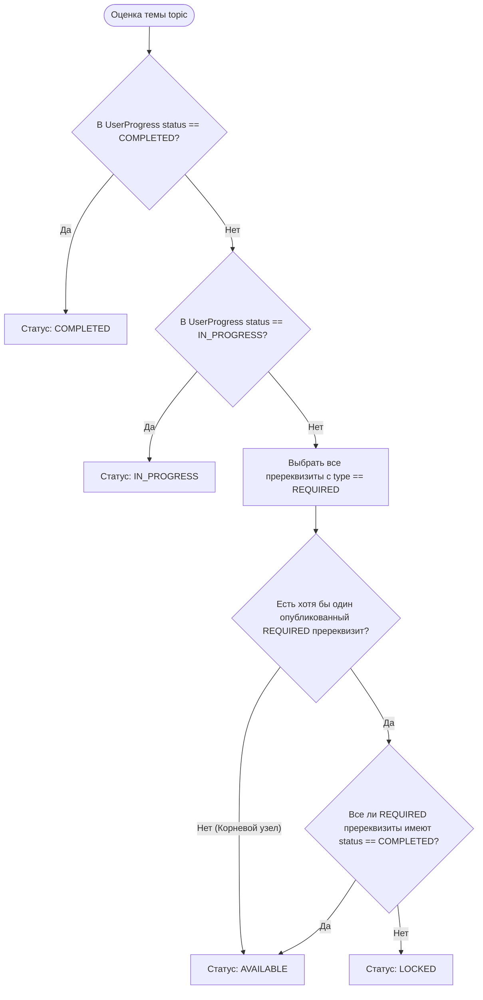
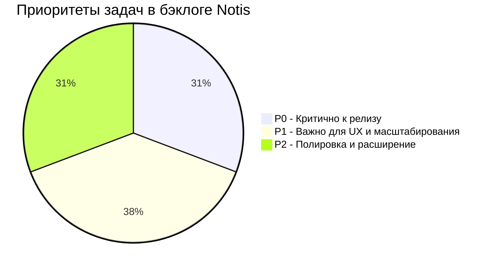

# Notis — Product Requirements Document (PRD)

> **Статус документа**: Living Document / Single Source of Truth  
> **Версия**: 1.1.0  
> **Дата**: Сентябрь 2026  
> **Роли**: Principal Product Manager & Lead Software Architect  
> **Стек**: Next.js 16 (App Router, Turbopack), React 19, TypeScript 5.8, Tailwind CSS v4, Prisma 6.4, Neon PostgreSQL, Auth.js v5, @xyflow/react v12.4, Zod v3.24

---

## 1. Executive Summary & Product Vision

### 1.1. Миссия и позиционирование
**Notis** — это специализированная образовательная платформа нового поколения, созданная для изучения сложных технических и инженерных дисциплин (Computer Science, распределенные системы, системное программирование, архитектура ПО, DevOps/SRE).

Традиционные LMS (Learning Management Systems) страдают от фундаментальных ограничений:
1. **Линейная жесткость**: принуждение студента к последовательному потреблению контента игнорирует вариативность бэкграунда и не отражает реальную графовую структуру знаний.
2. **Иллюзия компетентности (Fluency Illusion)**: пассивное чтение текста и поверхностные тесты с клиентской валидацией создают ложное ощущение понимания.
3. **Кривая забывания Эббингауза**: отсутствие системного интервального повторения приводит к утрате до 80% изученного материала в течение 30 дней.

**Позиционирование Notis**: нелинейный адаптивный тренажер инженерного мышления, объединяющий интерактивную карту компетенций (Roadmap Directed Acyclic Graph), механику тумана войны (Fog of War), доверенную серверную оценку знаний (Zero-Trust Quiz Engine) и математически выверенное интервальное повторение (SuperMemo-2).

### 1.2. Ключевые ценностные предложения (Value Propositions)
- **Roadmap Fog of War**: Визуализация курса в виде ориентированного ациклического графа (DAG). Темы открываются динамически только при освоении их строгих пререквизитов. Студент видит структуру целиком, но фокусируется на актуальной границе своих знаний.
- **Zero-Trust Quiz Engine**: Ни один правильный ответ или критерий оценки не утекает в браузер до завершения проверки. Проверка осуществляется изолированно на сервере с защитой от перебора (XP Anti-Exploit) и детализированным разбором ошибок через Markdown.
- **Spaced Repetition System (SM-2)**: Интегрированный в платформу тренажер карточек с динамическим расчетом коэффициента легкости ($EF$) и интервалов повторения. Карточки генерируются автоматически по мере сдачи тем и квизов.
- **Visual Creator Studio**: Профессиональная авторская среда на базе бесконечного холста `@xyflow/react` для конструирования образовательных графов, настройки связей, версионирования тем и управления жизненным циклом курса.

---

## 2. Архитектурный стек и технические инварианты

### 2.1. Технологический стек
| Компонент | Технология | Обоснование |
| :--- | :--- | :--- |
| **Фреймворк** | Next.js 16.3.4 (App Router, Turbopack) | Серверные компоненты (RSC) для максимальной производительности первого рендера, Fast Refresh, потоковая передача (Streaming). |
| **UI Библиотека** | React 19 (React DOM 19) | Поддержка `useTransition`, `useActionState`, Actions и серверных примитивов. |
| **База данных** | Neon PostgreSQL (Serverless) | Реляционная целостность, поддержка транзакций, масштабирование соединений через Connection Pooling (pgbouncer). |
| **ORM** | Prisma ORM 6.4.1 | Строгая типизация запросов, автогенерация типов, миграции, поддержка транзакций `$transaction`. |
| **Стилизация** | Tailwind CSS v4 | CSS-first конфигурация через `@theme`, строгие дизайн-токены (цвета поверхностей, статусов, текста), отсутствие рантайм-накладных расходов. |
| **Аутентификация** | Auth.js v5 (NextAuth.js v5 beta 30) | Сессии на базе базы данных через `@auth/prisma-adapter`, расширение JWT/Session полями `id` и `role`, поддержка Credentials & OAuth. |
| **Интерактивный граф** | `@xyflow/react` v12.4.4 | Аппаратно-ускоренный рендеринг бесконечного холста, поддержка кастомных узлов, ребер, зума, миникарты и драг-энд-дропа. |
| **Валидация** | Zod v3.24.2 | Детерминированная валидация данных на границе клиент-сервер, вывод TypeScript-типов (`z.infer`). |
| **Рендеринг контента** | `react-markdown` + `remark-gfm` + `rehype-highlight` | Безопасный рендеринг Markdown со стилизацией под дизайн-систему, подсветкой синтаксиса и кнопкой копирования кода. |
| **Тестирование** | Node.js Test Runner / Vitest / `tsx` | Быстрое выполнение тестов без сборки вебпаком, 108 тестов покрывают критические доменные функции и Server Actions. |

### 2.2. Архитектурные паттерны и изоляция доменов (FSD-lite)
Проект структурирован по модульному принципу:
```
notis/
├── app/                  # Presentation Layer: маршруты Next.js App Router (RSC + Client Boundary)
├── prisma/               # Database Layer: схема, миграции, сид
├── src/
│   ├── modules/          # Доменные модули (Domain Boundaries)
│   │   ├── gamification/ # Профиль, уровни, стрик, активность
│   │   ├── quiz/         # Квизы, степпер, типы вопросов, движок оценки
│   │   ├── roadmap/      # Граф курса, расчет Fog of War, DTO
│   │   ├── spaced-repetition/ # SM-2, карточки, повторение
│   │   ├── studio/       # Авторская студия, узлы React Flow, сайдбары
│   │   └── topic/        # Ридер тем, тезисы, Markdown
│   ├── server/           # Server Infrastructure Layer
│   │   ├── actions/      # Safe Server Actions (Next.js "use server")
│   │   ├── auth/         # Аутентификация, NextAuth config, RBAC guards
│   │   └── db/           # Синглтон клиента Prisma
│   └── shared/           # Cross-cutting concerns
│       ├── config/       # Глобальные константы, роуты, правила
│       ├── lib/          # Утилиты (slugify, formatters)
│       └── ui/           # Дизайн-система (Button, Card, Input, Modal, etc.)
```

#### Инварианты межмодульного взаимодействия:
1. **Модульные фасады (`index.ts`)**: Каждый домен внутри `src/modules/<domain>/` предоставляет публичный фасад `index.ts`. Импорт внутренних файлов в обход фасада запрещен.
2. **Разделение RSC и Client Components**: Загрузка данных из БД производится в серверных компонентах (RSC) через сервисный слой (`topic-service.ts`, `roadmap-service.ts`). Клиентские компоненты (`"use client"`) получают готовые DTO и вызывают мутации только через Safe Actions.
3. **Запрет экспорта не-функций из `"use server"`**: Файлы с директивой `"use server"` экспортируют *исключительно* асинхронные серверные действия. Схемы Zod, интерфейсы и константы располагаются либо в отдельных сервисных файлах, либо импортируются через безопасные фасады.

### 2.3. Safe Action Pipeline (Result Pattern)
Все мутации системы инкапсулированы через обертку `createSafeAction`:
```typescript
export type ActionErrorCode =
  | "UNAUTHORIZED"
  | "FORBIDDEN"
  | "NOT_FOUND"
  | "BAD_REQUEST"
  | "CONFLICT"
  | "INTERNAL_SERVER_ERROR";

export type ActionResult<T> =
  | { success: true; data: T }
  | { success: false; error: ActionError };
```

#### Пайплайн обработки вызова:
1. **Zod Validation**: Валидация сырого входа `rawInput` через `schema.safeParseAsync`. При ошибке формируется код `BAD_REQUEST` со структурированным объектом `fieldErrors`. Обработчик бизнес-логики не вызывается.
2. **Auth Context Injection**: Автоматическое извлечение сессии через `getAuthSession()` и инъекция в контекст `{ session }`.
3. **Controlled Exception Handling**: Перехват исключений класса `ActionException(code, message)`.
4. **Unhandled Exception Obfuscation**: Любая непредвиденная ошибка БД или рантайма логируется на сервере, а клиенту возвращается обезличенное сообщение с кодом `INTERNAL_SERVER_ERROR`.
5. **Next.js System Errors**: Ошибки `NEXT_REDIRECT` и `NEXT_NOT_FOUND` пробрасываются дальше для штатной работы роутера.

---

## 3. Ролевая модель и матрица доступов (RBAC)

### 3.1. Описание ролей
- **GUEST (Неавторизованный пользователь)**: Ознакомление с платформой, просмотр витрины курсов, бесплатный предварительный просмотр тем с флагом `isFreePreview: true`.
- **USER / STUDENT (Студент платформы)**: Прохождение открытых курсов, запись на курсы (`CourseEnrollment`), фиксация прогресса тем, сдача квизов, прохождение интервального повторения SM-2, прокачка XP и стрика.
- **AUTHOR (Автор контента)**: Создание собственных курсов, редактирование графа роадмапа в Студии (`/studio/[slug]`), управление темами, квизами и публикацией.
- **ADMIN (Супер-администратор)**: Неограниченный доступ ко всем курсам системы, управление пользователями, перевод ролей, модерация контента.

### 3.2. Матрица доступов (RBAC Matrix)

| Домен / Действие | GUEST | STUDENT (USER) | AUTHOR | ADMIN | Защитный механизм |
| :--- | :---: | :---: | :---: | :---: | :--- |
| **Каталог курсов (`/courses`)** | Чтение | Чтение + Фильтрация | Чтение + Фильтрация | Чтение + Фильтрация | Публичный RSC |
| **Запись на курс (`enrollCourseAction`)** | ❌ (401) | ✅ | ✅ | ✅ | `session.user` check |
| **Просмотр роадмапа (`/courses/[slug]`)** | ✅ (Fog of War для гостя) | ✅ (Персональный прогресс) | ✅ | ✅ | `getRoadmapGraph` |
| **Чтение тем (`isFreePreview = true`)** | ✅ | ✅ | ✅ | ✅ | `getTopicDetails` |
| **Чтение тем (обычные)** | ❌ (редирект/401) | ✅ (если тема AVAILABLE/COMPLETED) | ✅ | ✅ | `assertTopicAccess` |
| **Сдача квиза (`submitQuizAction`)** | ❌ (401) | ✅ | ✅ | ✅ | Safe Action Guard |
| **Пересдача квиза (`retakeQuizAction`)** | ❌ (401) | ✅ | ✅ | ✅ | Safe Action Guard |
| **Тренажер SM-2 (`/practice`, `reviewCardAction`)** | ❌ (401) | ✅ | ✅ | ✅ | Safe Action Guard |
| **Личный кабинет (`/profile`)** | ❌ (401) | ✅ | ✅ | ✅ | Server Redirect to `/login` |
| **Создание курса (`createCourseAction`)** | ❌ (401) | ❌ (403) | ✅ | ✅ | Role check (`AUTHOR` \| `ADMIN`) |
| **Авторская Студия (`/studio/[slug]`)** | ❌ (401) | ❌ (403) | ✅ (только свои курсы) | ✅ (любые) | `assertCourseAuthor` Guard |
| **Редактирование тем/квизов в Студии** | ❌ (401) | ❌ (403) | ✅ (OWNER / EDITOR) | ✅ | `assertCourseAuthor` Guard |
| **Публикация темы / курса** | ❌ (401) | ❌ (403) | ✅ (OWNER) | ✅ | `assertCourseAuthor` Guard |
| **Удаление курса (`deleteCourseAction`)** | ❌ (401) | ❌ (403) | ✅ (только OWNER) | ✅ | `assertCourseAuthor` Guard |

### 3.3. Реализация проверки прав автора (`assertCourseAuthor`)
Инкапсулирована в `src/server/auth/rbac.ts`:
1. Извлекает канонический `User.id` из базы.
2. Проверяет глобальную роль: если `role === "ADMIN"`, доступ предоставляется немедленно с ролью `ADMIN`.
3. Извлекает запись `CourseCollaborator` для текущего курса:
   - `role === "OWNER"` $\implies$ полный доступ к настройкам, публикации и удалению курса.
   - `role === "EDITOR"` $\implies$ редактирование структуры графа, контента тем и квизов (удаление курса запрещено).
4. При отсутствии привилегий выбрасывает `ActionException("FORBIDDEN", "Недостаточно прав для редактирования курса")`.

---

## 4. Детальная спецификация доменных модулей

### 4.1. Roadmap & Fog of War (`src/modules/roadmap`)

#### Модель графа:
- **Узлы (Nodes)**: Модель `Topic`, сгруппированная по этапам `Tier`. Каждый узел обладает координатами `positionX`, `positionY` (извлекаются из `UserGraphLayout`, затем `DefaultGraphLayout`, либо рассчитываются детерминированным алгоритмом `computeDeterministicLayout`).
- **Связи (Edges)**: Модель `TopicPrerequisite`:
  - `REQUIRED`: Строгий пререквизит (сплошная стрелка на холсте). Блокирует открытие дочерней темы.
  - `RECOMMENDED`: Рекомендованный пререквизит (пунктирная стрелка). Не блокирует доступ, но визуализирует логический контекст.

#### Алгоритм расчета видимости узлов (Fog of War Engine):
Чистая функция `transformCourseToGraphDTO(options)` выполняет детерминированный расчет статуса каждого узла для текущего пользователя:



#### Спецификация состояний:
- `LOCKED`: Узел затемнен (`opacity-50`, иконка `Lock`), клик заблокирован (или открывает тултип со списком недостающих тем).
- `AVAILABLE`: Узел подсвечен (`border-status-available`), доступен для перехода в ридер.
- `IN_PROGRESS`: Пользователь открывал материал или начал квиз, но не завершил его.
- `COMPLETED`: Тема освоена. Ребра, исходящие из завершенного узла, переходят в состояние `isUnlocked: true`.

#### Отслеживание версий контента (`hasUpdate`):
Если автор темы обновил материал и увеличил версию (`Topic.version > UserProgress.completedVersion`), узел получает флаг `progress.hasUpdate: true`. На карточке отображается бэдж **«Обновлено»**, информирующий студента о появлении новых тезисов или вопросов.

---

### 4.2. Topic Reader & Content Management (`src/modules/topic`)

#### Модель контента темы:
- `summary`: Краткая выжимка материала (Markdown).
- `keyPoints`: Массив ключевых концепций (`String[]`).
- `pitfalls`: Массив распространенных ошибок и ловушек (`String[]`).
- `contentBlocks`: JSON-структура для расширенного форматированного лонгрида.
- `version`: Целочисленная версия материала (по умолчанию 1).

#### Сценарии завершения темы:
1. **Тема с квизом (`quizQuestions.length > 0`)**:
   - Кнопка в футере открывает модальное окно квиза `QuizModal`.
   - Завершение темы и начисление опыта происходят *исключительно* на сервере при успешной сдаче квиза (`score >= 80%`).
2. **Тема без квиза (`quizQuestions.length === 0`)**:
   - Отображается кнопка **«Я освоил материал»**, вызывающая `completeTopicAction({ courseSlug, topicSlug })`.
   - Сервер фиксирует `UserProgress.status = "COMPLETED"`, проставляет `completedVersion = Topic.version`, начисляет пользователю **+50 XP** (если это первое прохождение) и обновляет счетчик `CourseEnrollment.completedTopicsCount`.

---

### 4.3. Quiz Engine (Zero-Trust) (`src/modules/quiz`)

#### Принцип Zero-Trust (Нулевого Доверия):
Клиентский компонент `QuizContainer` получает только DTO с публичной информацией:
```typescript
export interface QuizQuestionDTO {
  id: string;
  question: string;
  type: "SINGLE_CHOICE" | "MULTIPLE_CHOICE";
  options: { id: string; text: string; codeSnippet?: string }[];
  explanation?: string; // Отправляется клиенту ТОЛЬКО после завершения теста
}
```
Поля `correctAnswerIndexes` и правила оценивания **никогда не передаются клиенту в исходном виде**.

#### Жизненный цикл прохождения и оценки:
1. Пользователь отвечает на вопросы в интерфейсе `QuizStepper` / `QuizCard`.
2. По завершении формируется мапа ответов `{ [questionId]: string[] }` и отправляется в `submitQuizAction`.
3. Серверная функция `evaluateQuizSubmission`:
   - Сопоставляет выбранные индексы с эталонными `Question.correctAnswerIndexes`.
   - Для `SINGLE_CHOICE`: точное совпадение единственного индекса.
   - Для `MULTIPLE_CHOICE`: полное совпадение множеств правильных ответов без лишних выборов.
   - Рассчитывает итоговый балл: $\text{score} = \text{round}((\text{correctCount} / \text{totalCount}) \cdot 100)$.
   - Тест считается сданным при $\text{score} \ge 80\%$.
4. **Транзакционная запись попытки**: В базе сохраняются строки `UserQuizAttempt` для каждого вопроса с указанием `isCorrect` и выбранных вариантов.

#### XP-логика и защита от накрутки (XP Anti-Exploit):
- **Первое успешное прохождение (`isFirstCompletion === true`)**:
  - Начисление за тему: **+50 XP** (`XP_TOPIC_COMPLETION`).
  - Бонус за идеальный результат ($\text{score} == 100\%$): **+25 XP** (`XP_QUIZ_PERFECT_SCORE`).
  - Суммарно: **до +75 XP**.
- **Повторное прохождение (Пересдача)**:
  - Если тема уже была в статусе `COMPLETED`, начисление очков опыта строго блокируется (`xpEarned = 0`).
  - Экшен `retakeQuizAction`:
    * Транзакционно удаляет старые записи `UserQuizAttempt` пользователя для вопросов данной темы.
    * Позволяет студенту перепройти тест с чистого листа для закрепления знаний.
    * Не сбрасывает статус освоения темы в роадмапе (`COMPLETED` сохраняется).

---

### 4.4. Spaced Repetition System (SM-2 Engine) (`src/modules/spaced-repetition`)

#### Математическая модель SuperMemo-2 (SM-2):
Алгоритм вычисляет дату следующего повторения карточки на основе субъективной оценки качества воспоминания $q \in [0, 5]$:
- $q = 5$: Идеальный ответ без колебаний.
- $q = 4$: Правильный ответ после небольшого раздумья.
- $q = 3$: Правильный ответ с заметным усилием.
- $q = 2$: Неправильный ответ, но правильный легко вспомнился.
- $q = 1$: Неправильный ответ, правильный вариант смутно знаком.
- $q = 0$: Полный провал памяти (Blackout).

#### Формула обновления фактора легкости (Easiness Factor, $EF$):
$$EF' = \max\left(1.3, \; EF + \left(0.1 - (5 - q) \cdot (0.08 + (5 - q) \cdot 0.02)\right)\right)$$

#### Формула расчета интервала повторения ($I$, в днях):
$$I(n) = \begin{cases} 
1, & \text{если } q < 3 \quad (\text{сброс цикла, } n=0) \\
1, & \text{если } q \ge 3 \text{ и } n = 0 \\
6, & \text{если } q \ge 3 \text{ и } n = 1 \\
\text{round}(I(n-1) \cdot EF'), & \text{если } q \ge 3 \text{ и } n \ge 2
\end{cases}$$
где $n$ — количество успешных повторений подряд (`repetitionCount`).

#### Пайплайн колоды повторения:
1. **Автоматическая инициализация**: При завершении темы (`UserProgress.status = "COMPLETED"`) все привязанные к теме вопросы автоматически попадают в очередь повторения `UserQuestionReview` с датой `reviewDueAt = now()`.
2. **Экран тренировки (`/practice`)**:
   - `getDueFlashcards(userId)` извлекает до 20 карточек, у которых `reviewDueAt <= now()`.
   - Если активных карточек нет, выводится поздравление и время следующего повторения.
3. **Фиксация оценки (`reviewCardAction`)**:
   - Принимает `{ cardId, quality }`.
   - Пересчитывает $EF$, $I$, $n$ по алгоритму SM-2.
   - Обновляет `UserQuestionReview` новой датой `reviewDueAt = now() + interval * 24h`.
   - Засчитывает активность в стрик пользователя.

---

### 4.5. Gamification & Progression (`src/modules/gamification`)

#### Квадратичная формула уровней (Quadratic Level Curve):
Количество совокупного опыта, необходимого для достижения уровня $L$:
$$\text{TotalXP}(L) = 100 \cdot (L - 1)^2$$
- Уровень 1: 0 XP
- Уровень 2: 100 XP
- Уровень 3: 400 XP
- Уровень 4: 900 XP
- Уровень 5: 1600 XP
- Уровень 10: 8100 XP

Обратная формула расчета текущего уровня по очкам XP:
$$L = 1 + \left\lfloor \sqrt{\frac{\text{XP}}{100}} \right\rfloor$$
Прогресс внутри уровня рассчитывается относительно дельты между базовым XP текущего уровня и следующего:
$$\text{progressPercentage} = \text{round}\left( \frac{\text{XP} - \text{BaseXP}(L)}{\text{BaseXP}(L+1) - \text{BaseXP}(L)} \cdot 100 \right)$$

#### Streak Engine (Движок ударного режима):
- Константа срока действия стрика: `STREAK_EXPIRATION_HOURS = 36` часов.
- **Правило заморозки/сохранения**: Студенту дается 36 часов с момента последней активности (`lastStudyAt`). Это предотвращает сгорание стрика при смене часовых поясов или занятиях поздно вечером.
- **Статусы стрика**:
  1. `isActiveToday = true`: пользователь совершил результативное действие (сдал квиз, отметил тему или повторил карточку) сегодня по календарю.
  2. `isExpiringSoon = true`: с момента последней активности прошло от 24 до 36 часов. В Navbar и профиле загорается предупреждающий индикатор («Стрик под угрозой!»).
  3. `streak = 0`: прошло более 36 часов, ударный режим обнуляется.

#### Heatmap активности (Матрица активности за год):
В `getProfileData` агрегируются все события пользователя за последние 365 дней:
- Завершение тем (`UserProgress.completedAt`).
- Попытки прохождения тестов (`UserQuizAttempt.createdAt`).
Формируется карта `{ [YYYY-MM-DD]: count }` с 4 уровнями интенсивности для визуализации в личном кабинете.

---

### 4.6. Creator Studio (Visual Course Builder) (`src/modules/studio`)

#### Холст и манипуляция узлами:
- Полноэкранный редактор на базе `@xyflow/react` с поддержкой миникарты, сетки и элементов управления масштабом.
- **Дебаунс координат**: При перемещении узлов координаты накапливаются в локальном стейте и сбрасываются на сервер пачкой через `updateNodePositionsAction` с задержкой 500 мс, минимизируя нагрузку на базу данных.

#### Управление графом и валидация циклов:
- Связывание узлов через перетаскивание коннекторов (Handles): вызывает `connectPrerequisiteAction`.
- **Защита от циклов**:
  1. *Self-connection*: запрет связывания узла с самим собой (`topicId === prerequisiteId`).
  2. *Mutual cycle*: проверка на существование обратного ребра `topicId_prerequisiteId` в таблице `TopicPrerequisite`. При обнаружении возвращается `ActionException("CONFLICT", "Циклическая зависимость: темы блокируют друг друга")`.
- Удаление связей: клик по ребру или кнопка удаления вызывают `disconnectPrerequisiteAction`.

#### Боковая шторка темы (`StudioTopicDrawer`):
- Редактирование заголовка темы, уровня сложности (`BEGINNER`, `INTERMEDIATE`, `ADVANCED`, `EXPERT`).
- Ввод выжимки (`summary`) с переключением между режимом редактирования и живым предпросмотром Markdown.
- Редактирование массивов «Ключевые концепции» и «Ловушки».
- Конструктор квизов: создание вопросов `SINGLE_CHOICE` и `MULTIPLE_CHOICE`, ввод вариантов ответов с опциональными фрагментами кода (`codeSnippet`), выбор правильных индексов, удаление вопросов.
- **Управление публикацией**: чекбокс публикации темы с опцией инкремента версии (`bumpVersion: true`), оповещающей студентов об обновлении.

---

### 4.7. Course Catalog & Marketplace (`app/courses`)

#### Витрина и фильтрация:
- Отображение всех опубликованных курсов (`isPublished: true`, `isArchived: false`).
- Серверная фильтрация через URL `searchParams`:
  - `q`: полнотекстовый поиск по названию и описанию курса.
  - `difficulty`: фильтр по сложности (`ALL`, `BEGINNER`, `INTERMEDIATE`, `ADVANCED`, `EXPERT`).
- **Course Card**: отображение обложки, названия, тегов, бейджа сложности, количества тем и индикатора зачисления студента.
- **Действие зачисления (`enrollCourseAction`)**:
  - Создает или обновляет запись `CourseEnrollment` со статусом `ACTIVE`.
  - Привязывает студента к курсу, позволяя отслеживать прогресс прохождения.

---

### 4.8. Platform Administration (Backoffice)
Текущие возможности и требования к расширению:
- **Управление курсами из интерфейса Студии**:
  - `createCourseAction`: создание нового курса с дефолтным тиром «Основы» и назначением автора `OWNER`.
  - `updateCourseSettingsAction`: изменение названия, описания и переключатель глобальной публикации курса (`isPublished`).
  - `deleteCourseAction`: полное каскадное удаление курса со всеми темами, квизами и прогрессом (доступно `ADMIN` и `OWNER`).
- **Бэклог Backoffice (P1)**: отдельный дашборд `/admin` для просмотра реестра всех пользователей, изменения ролей (`USER` $\leftrightarrow$ `AUTHOR` $\leftrightarrow$ `ADMIN`), ручной блокировки нарушителей (`User.isBanned = true`) и аудита платежных транзакций (`Payment`).

---

## 5. Edge Cases & Safety Rails (Пограничные сценарии)

### 5.1. Каскадное удаление курса и темы
- **Удаление темы (`deleteTopicAction`)**:
  - Удаление темы из графа может сломать зависимые темы, если они опираются на нее как на пререквизит.
  - *Решение*: В рамках `$transaction` удаляются все ребра `TopicPrerequisite`, где тема выступала `topicId` или `prerequisiteId`. Дочерние темы автоматически пересчитывают свой статус доступности (если других пререквизитов нет, они становятся `AVAILABLE`).
  - Очищаются координаты в `DefaultGraphLayout` и `UserGraphLayout`, записи `UserQuizAttempt`, `UserQuestionReview`, вопросы и прогресс пользователей.
  - Декрементируется счетчик `Course.publishedTopicsCount`.
- **Удаление курса (`deleteCourseAction`)**:
  - Полная транзакционная зачистка всех сущностей курса во избежание образования висячих записей (Orphan records) в базе Neon.

### 5.2. Обработка тем без квизов
- Не все инженерные темы требуют формального тестирования (например, обзорные или установочные темы).
- *Решение*: Если у темы нет вопросов (`questions.length === 0`), ридер темы блокирует открытие модалки квиза и предоставляет прямую кнопку «Я освоил материал» (`completeTopicAction`). Тема переходит в `COMPLETED` с начислением базовых +50 XP.

### 5.3. Защита от глубоких транзитивных циклов в графе
- Простая проверка обратного ребра ($A \to B$ при наличии $B \to A$) предотвращает циклы длины 2.
- *Safety Rail*: Для защиты от циклов произвольной длины ($A \to B \to C \to A$) при создании связи запускается алгоритм обхода в глубину (DFS / Cycle Detection). При обнаружении пути от целевого узла к исходному операция отклоняется с ошибкой `CONFLICT`.

### 5.4. Защита от накрутки опыта (XP Anti-Exploit)
- Если студент сдает квиз повторно или кликает повторное завершение, начисление XP строго проверяется по флагу `isFirstCompletion = existingProgress?.status !== "COMPLETED"`. Повторные попытки начисляют 0 XP.

---

## 6. Gap Analysis & Prioritized Product Backlog



### [P0 - Критично к релизу (Release Blockers)]
1. **DFS Проверка транзитивных циклов в Студии**: Расширить `connectPrerequisiteAction` проверкой графа на циклы произвольной длины через рекурсивный поиск в глубину (DFS) перед вставкой ребра.
2. **Восстановление пароля (Password Reset Flow)**: Внедрение токенов сброса пароля (`VerificationToken`) и отправка email со ссылкой на смену пароля для пользователей Credentials Provider.
3. **Session Refresh при смене ролей**: Автоматическое обновление JWT/Session при повышении пользователя до `AUTHOR` без необходимости повторного логина.
4. **Rate Limiting на Server Actions**: Внедрение ограничения частоты вызовов (Redis Upstash или in-memory) для эндпоинтов `submitQuizAction` и `registerUserAction` для предотвращения брутфорса и спама.

### [P1 - Важно (Core UX & Platform Health)]
1. **Административная панель Backoffice (`/admin`)**: Интерфейс для супер-администратора: список пользователей, переключение ролей, бан, статистика прохождений платформы.
2. **Поддержка Code Runner в квизах (`QuestionType = CODE`)**: Возможность выполнения кода на TypeScript/Python в изолированной песочнице (WebAssembly / Piston API) с проверкой тест-кейсов.
3. **Экспорт и импорт курсов в JSON/YAML**: Инструмент для авторов, позволяющий версионировать курсы в Git-репозиториях и загружать готовые роадмапы в один клик.
4. **Глобальный поиск (Cmd+K Palette)**: Быстрый поиск по всем темам, терминам и курсам платформы с переходом в нужный узел графа.
5. **Мультиязычность контента (i18n UI Switcher)**: Переключатель локалей интерфейса (RU/EN), использующий готовые таблицы `CourseTranslation` и `TopicTranslation`.

### [P2 - Полировка (Enhancements & Community)]
1. **Социальные профили и лидерборды**: Публичные профили студентов, сравнение стриков и витрина полученных достижений.
2. **Интерактивные комментарии и обсуждения в темах**: Ветка обсуждения сложных вопросов внутри ридера темы с модерацией автором.
3. **Мобильное приложение (PWA)**: Настройка Manifest и Service Worker для офлайн-повторения карточек SM-2 на смартфонах.
4. **Интеграция платежных шлюзов**: Подключение Stripe / CloudPayments для платных курсов по модели `ONE_TIME` или `SUBSCRIPTION` (согласно готовой схеме `Plan` и `Payment`).
